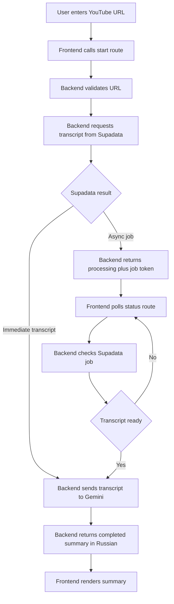

# YouTube Summary Backend Design

## Goal

Add a backend to the existing Next.js app so a user can submit a YouTube URL from [`app/page.tsx`](app/page.tsx), the system can fetch the transcript through Supadata, summarize it with Gemini in Russian, and return a result that works on local development and Vercel hosting without exposing API keys in client code.

## Current Project Context

The current frontend already has:

- a URL submission form in [`app/page.tsx`](app/page.tsx)
- a summary screen in [`app/summary/page.tsx`](app/summary/page.tsx)
- an existing route in [`app/api/summarize/route.ts`](app/api/summarize/route.ts)

The current backend implementation directly scrapes YouTube captions and streams text using an OpenAI model string. That should be replaced with a Supadata plus Gemini flow that is more reliable, configurable, and compatible with the requested deployment model.

## Constraints

- Summary output must be in Russian.
- The first version should return the summary now, while keeping the response shape extensible for future metadata.
- The app must work on free Vercel hosting and minimize resource usage.
- Secrets must never be committed to git or shipped to the browser.
- Local development should support [`.env.local`](.env.local).
- Production should support Vercel project environment variables.
- Long-running Supadata transcript jobs should use frontend polling rather than a single long server request.

## Recommended Approach

Use a lightweight orchestration layer inside Next.js route handlers under the existing `/api/summarize` path family.

### Why this approach

- avoids a separate backend service
- avoids persistent infrastructure such as Redis or a database
- avoids keeping a Vercel function open while polling Supadata
- matches the desired frontend experience with progress polling
- keeps costs lower on Vercel by making each request short and stateless

### Alternatives considered

#### Option 1: Synchronous single-request flow

The backend waits for Supadata and Gemini in one request and returns only when complete.

Pros:
- simplest implementation
- minimal frontend changes

Cons:
- weak fit for Supadata async jobs
- higher risk of Vercel timeouts
- poor handling for longer videos

#### Option 2: Stateless orchestration with backend job token

The backend starts work, returns a protected token when Supadata needs polling, and the frontend polls our status endpoint.

Pros:
- best balance of robustness and low infrastructure cost
- works with free Vercel constraints
- no server-side persistent store required

Cons:
- slightly more complex route design
- requires token signing logic and polling UX

#### Option 3: Persistent job store

The backend stores job state in a database or cache.

Pros:
- strongest observability and recovery model
- easiest future expansion to history or analytics

Cons:
- unnecessary infrastructure for the first version
- higher setup and hosting complexity
- does not align with the goal of low resource usage

Recommended option: Option 2.

## Architecture

### Backend route family

Keep the API grouped under `/api/summarize`.

Proposed route structure:

- [`app/api/summarize/start/route.ts`](app/api/summarize/start/route.ts) starts the workflow
- [`app/api/summarize/status/route.ts`](app/api/summarize/status/route.ts) checks progress and completes summarization when ready

Optional shared helpers:

- [`lib/youtube.ts`](lib/youtube.ts) for URL validation and normalization
- [`lib/supadata.ts`](lib/supadata.ts) for transcript requests and status polling
- [`lib/gemini.ts`](lib/gemini.ts) for summary generation
- [`lib/job-token.ts`](lib/job-token.ts) for encoding and verifying stateless job tokens
- [`lib/env.ts`](lib/env.ts) for safe environment variable access
- [`lib/summarize-schema.ts`](lib/summarize-schema.ts) for shared response types

### Frontend flow

- [`app/page.tsx`](app/page.tsx) continues collecting the YouTube URL
- [`app/summary/page.tsx`](app/summary/page.tsx) starts the backend flow instead of calling a single streaming endpoint
- if the backend returns `processing`, the page polls the status endpoint
- if the backend returns `completed`, the page renders the Russian summary
- if the backend returns an error status, the page shows a stable retry message

## Data Flow



### Start route contract

Request body:

```json
{
  "url": "https://www.youtube.com/watch?v=qim8chAy7Mw"
}
```

Possible response shapes:

```json
{
  "status": "completed",
  "summary": "...",
  "meta": {
    "source": "youtube",
    "lang": "en"
  }
}
```

```json
{
  "status": "processing",
  "jobToken": "signed-token"
}
```

```json
{
  "status": "error",
  "error": {
    "code": "INVALID_URL",
    "message": "Invalid YouTube URL"
  }
}
```

### Status route contract

Request body or query:

```json
{
  "jobToken": "signed-token"
}
```

Possible response shapes:

```json
{
  "status": "processing"
}
```

```json
{
  "status": "completed",
  "summary": "...",
  "meta": {
    "source": "youtube",
    "lang": "en"
  }
}
```

```json
{
  "status": "error",
  "error": {
    "code": "SUMMARIZATION_FAILED",
    "message": "Failed to summarize video"
  }
}
```

## Supadata Integration Design

### Transcript request

The backend should call Supadata transcript with:

- `url` set to the normalized YouTube URL
- `text=true` to request plain transcript text
- `mode=auto` to prefer native transcript and fall back to generated transcript
- optional `lang=en` preference if helpful, while accepting fallback languages returned by Supadata

### Immediate transcript path

If Supadata returns transcript content directly:

1. validate transcript exists and is sufficiently useful
2. truncate or chunk only if needed to fit the Gemini request size budget
3. send transcript to Gemini with instructions to produce a concise Russian summary
4. return `completed`

### Async transcript path

If Supadata returns a job ID:

1. create a protected job token containing the minimum data needed to continue
2. return `processing`
3. frontend polls the status route
4. status route checks Supadata once per request
5. if Supadata still reports queued or active, return `processing`
6. if Supadata reports completed, call Gemini and return `completed`
7. if Supadata reports failed, return a normalized error state

## Stateless Job Token Design

To avoid persistent storage on Vercel, the status route should not depend on in-memory state.

The signed token should contain only minimal resumable state, such as:

- Supadata job ID
- normalized source URL or a source identifier if still needed
- created-at timestamp
- version field for future compatibility

The token should be signed with `APP_JOB_TOKEN_SECRET` so the client cannot tamper with it.

This token is not a secret to the user, but it must be integrity-protected.

## Gemini Integration Design

### Model usage

Use Gemini through the official Generative Language API with a server-side `fetch` call from route handlers.

First-version behavior:

- no client-side Gemini calls
- no search grounding or external tools
- no long-lived stream requirement unless implementation makes it trivial
- response can be returned as normal JSON to simplify polling flow

### Prompt shape

The summarization prompt should:

- state that the output language must be Russian
- request a concise but useful summary
- prefer structured output such as short paragraphs or bullets
- ignore transcript noise where possible

Suggested output structure:

- short overview
- main ideas
- important takeaways

## Error Handling

Normalize backend failures into a stable API contract.

Suggested error codes:

- `INVALID_URL`
- `MISSING_URL`
- `CONFIGURATION_MISSING`
- `TRANSCRIPT_UNAVAILABLE`
- `VIDEO_INACCESSIBLE`
- `SUPADATA_PROCESSING`
- `SUPADATA_FAILED`
- `SUMMARY_TOO_SHORT`
- `SUMMARIZATION_FAILED`
- `INTERNAL_ERROR`

Error handling principles:

- never leak raw API keys or internal stack traces
- log server-side details only
- surface user-readable messages in the response
- make retryable states explicit
- distinguish invalid user input from upstream service failure

## Environment Variables and Secret Management

### Required variables

Local development in [`.env.local`](.env.local):

```dotenv
SUPADATA_API_KEY=
GEMINI_API_KEY=
APP_JOB_TOKEN_SECRET=
```

Production on Vercel should define the same variable names in the project settings.

### What each key is for

- `SUPADATA_API_KEY`: authenticates requests to Supadata transcript APIs
- `GEMINI_API_KEY`: authenticates requests to Gemini summarization APIs
- `APP_JOB_TOKEN_SECRET`: signs and verifies the stateless job token used by the status route

### Files to include

- [`.env.example`](.env.example) with placeholder keys only
- documentation telling the user to create [`.env.local`](.env.local) locally
- documentation showing exactly where to add Vercel environment variables

### Vercel documentation requirement

The implementation should include a step-by-step section covering:

1. open the Vercel project dashboard
2. open project settings
3. open the Environment Variables section
4. add each variable name exactly as documented
5. paste the secret value
6. choose the environments where it applies such as Production and Preview if needed
7. save the variables
8. redeploy so the new values are available to route handlers

This should be written thoroughly because the user has not used Vercel project variables before.

## Vercel Compatibility

The design intentionally avoids infrastructure that is unfriendly to free Vercel hosting.

Key compatibility choices:

- short route handler executions
- no background workers
- no reliance on server memory between requests
- no committed secrets
- no dependency on local-only files in production
- frontend polling instead of server-side long polling

## Testing Strategy

### Functional tests

At minimum verify:

1. provided sample URL flows from submission to Russian summary
2. immediate Supadata response path works
3. async Supadata job path works through frontend polling
4. invalid URL shows a stable error state
5. inaccessible or missing transcript produces a useful error
6. missing environment variables produce a configuration error

### Manual test priority

The first version can prioritize manual verification because the integration depends on real external services.

Suggested manual checks:

- local development using [`.env.local`](.env.local)
- successful summary for the provided sample URL
- status transitions on the summary page
- graceful retry behavior
- deployment on Vercel with configured environment variables

### Automated test opportunities

If time permits during implementation:

- unit tests for URL validation
- unit tests for job token encode and decode logic
- unit tests for API response normalization
- mocked tests for immediate and processing Supadata responses

## Implementation Notes for Existing Files

### Replace current route behavior

[`app/api/summarize/route.ts`](app/api/summarize/route.ts) currently:

- scrapes YouTube captions directly
- assumes a single request lifecycle
- uses a model configuration that does not match the requested Gemini backend

This route should either be replaced with the new route family or converted into the start endpoint if keeping the existing path is cleaner.

### Frontend adjustments

[`app/summary/page.tsx`](app/summary/page.tsx) should move from reading a streamed text body to managing a small state machine:

- `idle`
- `starting`
- `processing`
- `completed`
- `error`

That change will support both the immediate and async transcript paths while keeping the UI simple.

## API Keys Needed From User

The implementation requires exactly these secrets:

- Supadata API key for transcript requests
- Gemini API key for summary generation
- one random secret string for `APP_JOB_TOKEN_SECRET`

Placement:

- local development: [`.env.local`](.env.local)
- Vercel deployment: project Environment Variables with the same names

## Non-Goals for First Version

- transcript history storage
- user accounts
- persistent summary database
- multi-provider LLM fallback
- screenshot generation
- advanced metadata enrichment beyond a forward-compatible `meta` field

## Approved Design Summary

Build a stateless Next.js backend on top of Supadata and Gemini, keep secrets server-side in [`.env.local`](.env.local) and Vercel project variables, use backend job tokens plus frontend polling for long transcript jobs, return Russian summaries, and keep the API contract extensible for future metadata.
